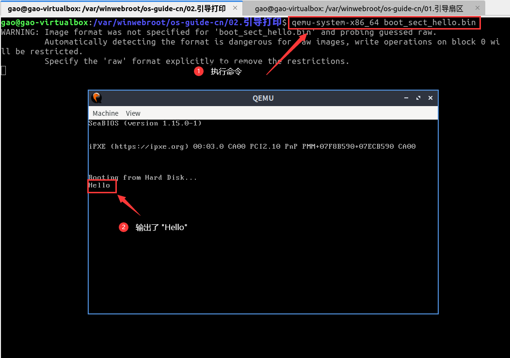

# 三，引导打印

## 需要了解的概念

- interrupts (中断)
- CPU registers (CPU 寄存器)

## 本章目标

**让之前的引导程序输出一些文本。**

> 在开始之前，你需要了解这些概念： interrupts, CPU registers

我们可以通过【中断】来完成这个功能。

在这个例子中我们将会向寄存器`al`(`ax`的低端部分)写入 “Hello” 单词的每个字符，把`0x0e`写入`ah`(`ax`的高端部分)然后发出中断`0x10`，这是视频服务的通用中断。

`0x0e`写入`ah`告诉视频中断我们想要以`tty`模式显示`al`寄存器中的内容。

我们将只设置一次 tty 模式，但在现实世界中，我们不能确保 `ah`的内容是恒定的。其他一些进程可能会在我们睡眠时在 CPU 上运行，没有正确清理，并在 `ah` 上留下垃圾数据。

在本例中，我们不需要注意这一点，因为我们是唯一运行在 CPU 上的东西。

代码如下：

```nasm
mov ah, 0x0e ; tty模式
mov al, 'H'
int 0x10
mov al, 'e'
int 0x10
mov al, 'l'
int 0x10
int 0x10 ; 'l' 还在 al 上
mov al, 'o'
int 0x10

jmp $ ; 跳转到当前地址 = 无限循环

; 填充和魔术数
times 510 - ($-$$) db 0
dw 0xaa55 
```

编译和运行：

```bash
nasm -fbin boot_sect_hello.asm -o boot_sect_hello.bin

qemu-system-x86_64 boot_sect_hello.bin
```

这样引导扇区就会输出 "Hello" 并且在无限循环上挂起。



<!--  -->
